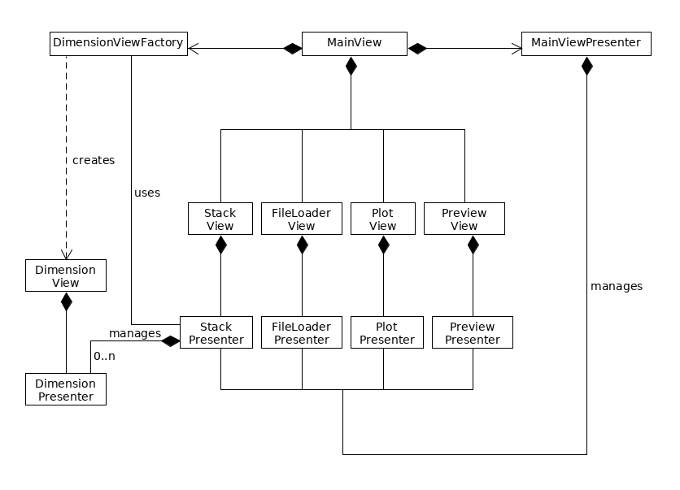
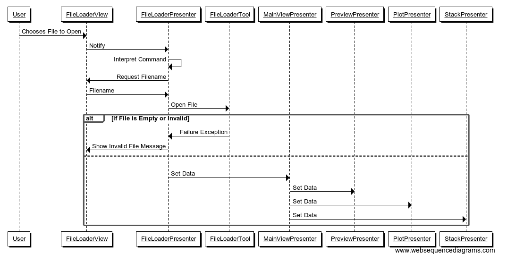
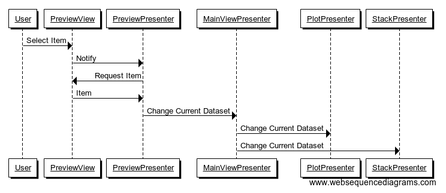

# Dataset Viewer Design

Programming Language: Python 3.6  
Coding Style: [PEP8](https://github.com/DMSC-Instrument-Data/dataset_viewer/blob/master/.flake8)  
Design Pattern: Model View Presenter (Passive View)

The [MSlice](https://github.com/mantidproject/mslice) tool served as a guideline when designing the Dataset Viewer and informed the choice of design pattern.
## Mockups
These mockups illustrate the interface for the following cases:
* The basic layout
* Colour scheme selection
* Zooming using a region of interest
### Basic Layout

### Selecting a Colour Scheme

### Zooming
  
Note: ROI zooming and undo/redo/reset buttons are already provided by `NavigationToolbar2QT`.
## Class Diagram
  
MainView: The main window that contains the different view elements in a `GridLayout`.  
DimensionView: Contains the label, slider, buttons, and stepper for an individual dimension.  
DimensionViewFactory: Factory for generating DimensionView objects.  
DimensionPresenter: Manages the DimensionView by preventing an X button from being released, and by preventing both an X and Y to be checked for the same dimension.  
StackView: The view that contains different DimensionView objects and stores them in "layers."  
StackPresenter: Manages the StackView and controls which one of its layer are visible. Also controls DimensionPresenters by enabling/disabling their slider and stepper and undoing user actions if they are invalid.  Creates DimensionViews when a file is loaded by using the DimensionViewFactory. Acts as the "master" of the DimensionViews.  
FileLoaderView: Contains a menu with an "Open..." option that creates a FileDialog.  
FileLoaderPresenter: Receives signals from the FileLoaderView and attempts to load a file then pass this to the MainViewPresenter. Displays a message on the FileLoaderView if a file couldn't be converted to a valid dataset.  
FileLoaderTool (not in diagram): Collection of functions for converting a NetCDF file to an OrderedDict of `Variable`s. Used by the FileLoaderPresenter.  
PlotView: Displays a plot.  
PlotPresenter: Manages generating an array to plot, clearing previous plots, labelling axes, etc.  
PreviewView: Displays a list of items in the dataset and their dimensions.  
PreviewPresenter: Receives a signal when an item has been selected on the PreviewView and informs the MainViewPresenter. Clears and populated the PreviewView when a new file has been loaded.  
MainPresenter: Mediates between the different presenters. Receives a data dictionary from the FileLoaderPresenter and sends this to the other presenters. Receives a key from the PreviewPresenter and informs the other presenters that the selection has changed. Receives information from the StackPresenter and sends this to the PlotPresenter.  
  
Note: The `NavigationToolbar2QT` that allows for redo/undo/etc is placed in the MainView.

## Sequence Diagrams
These sequence diagrams illustrate the object interactions that occur in the case of the following user actions: 
* Pressing an X button for one of the dimensions
* Changing the stepper value for one of the dimensions
* Loading a file and...
    * having a summary of its contents appear in a preview pane,
    * creating and setting up the widgets that appear on the Stack,
    * generating a default plot
* Changing a selection on the Preview
### Pressing an X Button

This diagram depicts the sequence of events that take place when an X button is checked. In the case when an X button is unchecked, this action is always reversed by the `DimensionPresenter`. "Visible Dimensions" refers to the dimensions that belong to the dataset that is currently being plotted.
### Stepper Change
  
A slider change has a similar result with the exception that the `DimensionPresenter` updates the stepper so that its value matches the slider.
### Loading a File 

### Stack Preparation
  
### Default Button/Slider/Stepper Configuration
  
Note: This takes place after loading a file or selecting a different element from the preview. If the data only has a single dimension then nothing takes place.
### Default Plot Preparation
  
Note: The toolbar that allows zooming and resetting the plot is in the MainView, so it must be informed whenever a new dataset is loaded.
### Selection Change
  
Note: The `PreviewPresenter` must call `text()` on the object returned by the `PreviewView` as it is a type of `QWidget`. This is then sent to the `MainViewPresenter`. The creation of a default button arrangement and a default plot follows the sequence of events shown above.
## Development Principles
* All programming will follow a test-driven development approach
* At least one reviewer must examine the code and this reviewer cannot be the developer of the feature
* All presenters and tests will be created prior to the development of any concrete views
## Testing and QA Principles
* Testing will be done with the `unittest` library
* `mock`s will be created for the the View
* Test coverage will be measured with the aim to achieve a coverage of at least 85%
* All tests will be executed by the CI build server
* Tests should be written to the same quality as the rest of the codebase
* Tests must not be changed without good justification
* Destructive and happy-path tests will be put in place
## Merging Conditions
* All tests pass
* All builds pass
* All reviewers find the code satisfactory
