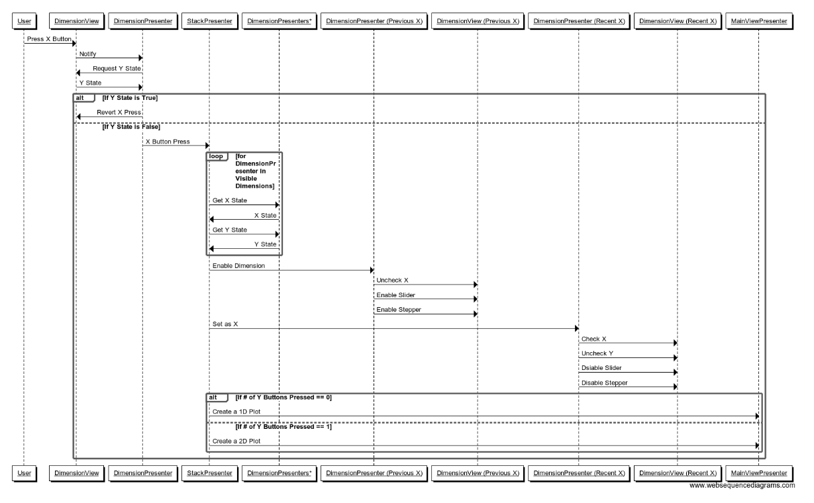

# Dataset Viewer Design

Programming Language: Python 3  
Coding Style: PEP8  
Design Pattern: Model View Presenter (Passive View)

The [MSlice](https://github.com/mantidproject/mslice) tool served as a guideline when designing the Dataset Viewer and informed the choice of design pattern.

## Class Diagram
  
DimensionView: Contains the slider, buttons, and stepper for an individual dimension.  
DimensionPresenter: Manages the behavior of the DimensionView.  
MainView: Contains the individual DimensionViews and the central plot.  
MainPresenter: Manages the behavior of the MainView and retrieves data from the MainModel.  
MainModel: Contains the data array. 
## Sequence Diagrams
### Pressing an X Button

### Stepper Change

## Development Principles
* Testing must take place alongside development
* Reviewing must take place before code is merged into the master branch
* The reviewer must be someone other than the developer
* Merging can only take place if all tests pass and the reviewer(s) finds the code satisfactory
## Testing and QA
* Use the `unittest` library
* `mock` the View
