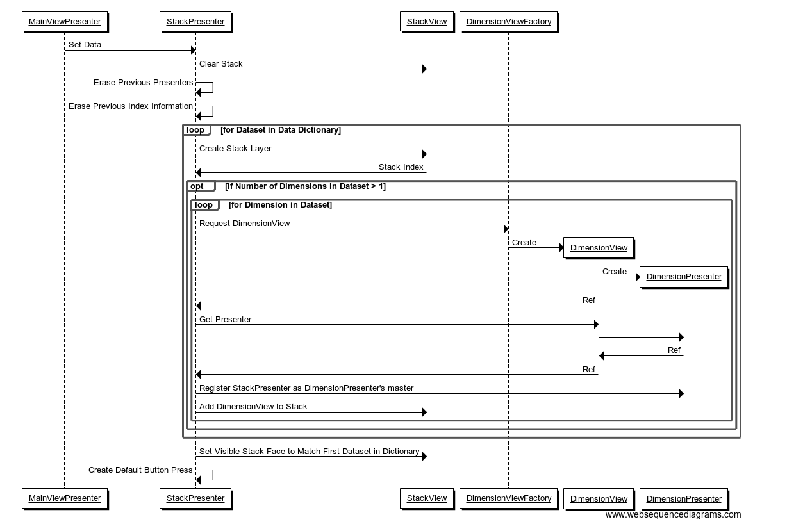

# Dataset Viewer Design

Programming Language: Python 3.6  
Coding Style: PEP8  
Design Pattern: Model View Presenter (Passive View)

The [MSlice](https://github.com/mantidproject/mslice) tool served as a guideline when designing the Dataset Viewer and informed the choice of design pattern.
## Mockups
These mockups illustrate the interface for the following cases:
* The basic layout
* Colour scheme selection
* Zooming using a region of interest
### Basic Layout

### Selecting a Colour Scheme

### Zooming

## Class Diagram
  
DimensionView: Contains the slider, buttons, and stepper for an individual dimension.  
DimensionPresenter: Manages the behavior of the DimensionView.  
MainView: Contains the individual DimensionViews and the central plot.  
MainPresenter: Manages the behavior of the MainView and retrieves data from the MainModel.  
MainModel: Contains the data array. 
## Sequence Diagrams
These sequence diagrams illustrate the object interactions that occur in the case of the following user actions: 
* Pressing an X button for one of the dimensions
* Changing the stepper value for one of the dimensions
* Loading a file and...
    * having a summary of its contents appear in a preview pane,
    * creating and setting up the widgets that appear on the Stack,
    * generating a default plot
* Changing a selection on the Preview
### Pressing an X Button

### Stepper Change

### Loading a File 

### Stack Preparation
  
Note: As the `DimensionView` doesn't inherit from `QWidget` but simply stores the Dimension View elements (label, buttons, etc), it can't be placed on the Stack. Instead the widgets it contains are retrieved from the `DimensionView` via a call to `get_widgets` and the items this method returns are placed in the Stack one-by-one.
Afterwards the `StackPresenter` instructs the Stack to set the face corresponding with the first dataset to be visible, as this will contain the sliders for the first dataset.
### Default Button/Slider/Stepper Configuration
  
Note: This takes place after loading a file or selecting a different element from the preview. If the data only has a single dimension then nothing takes place.
### Default Plot Preparation
  
Note: The toolbar that allows zooming and resetting the plot is in the MainView, so it must be informed whenever a new dataset is loaded or an existing dataset is sliced in a new way.
### Selection Change
  
Note: The `PreviewPresenter` must call `text()` on the object returned by the `PreviewView` as it is a type of `QWidget`. This is then sent to the `MainViewPresenter`. The creation of a default button arrangement and a default plot follows the sequence of events shown above.
## Development Principles
* All programming will follow a test-driven development approach
* At least one reviewer must examine the code and this reviewer cannot be the developer of the feature
* All presenters and tests will be created prior to the development of any concrete views
## Testing and QA Principles
* Testing will be done with the `unittest` library
* `mock`s will be created for the the View
* Test coverage will be measured with the aim to achieve a coverage of at least 85%
* All tests will be executed by the CI build server
* Tests should be written to the same quality as the rest of the codebase
* Tests must not be changed without good justification
* Destructive and happy-path tests will be put in place
## Merging Conditions
* All tests pass
* All builds pass
* All reviewers find the code satisfactory
